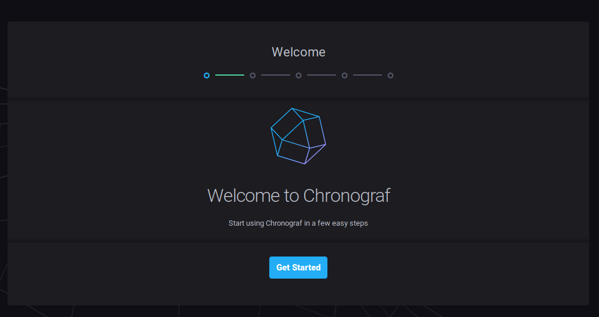
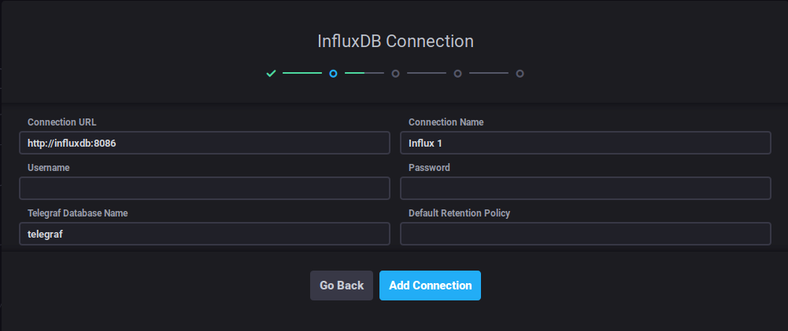
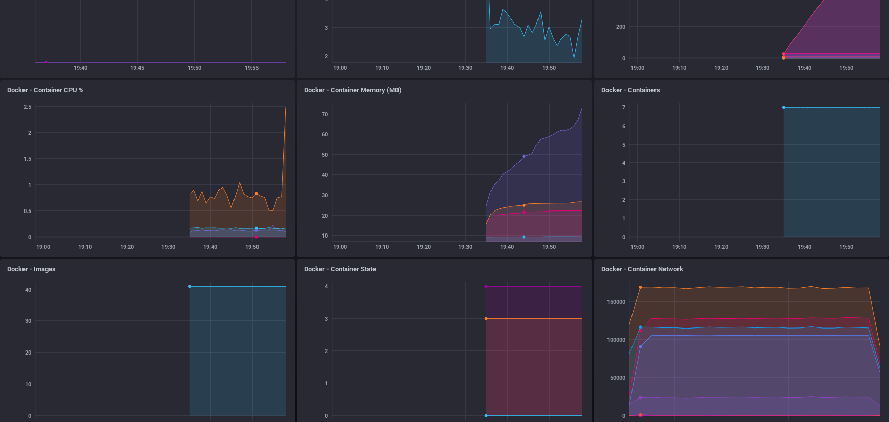

# Swarm-tick-stack-demo
docker swarm tick stack deploy demo.<br />
Please help out and create a pull request to make this better or submit an issue.<br />
Clone the repo https://github.com/digikin/swarm-tick-stack-demo.git.

## Start the cluster by declairing the masters IP address
```s
$ docker swarm init --advertise-addr <local ip>
```
## Use KVM or Hyper-v to create two virtual machines 
I use [Ubuntu Server 18.04.2 LTS](https://ubuntu.com/download/server) for VM's inside of a swarm. When you build your server keep to the naming convention like "swarm" and "swarm1".
Install docker on both of the virtual machines. I use the get-docker script for simplicity.

```s
$ ssh <user>@<VM-Machine1>
$ sudo passwd <create a root password>
$ sudo apt update && sudo apt upgrade -y
$ curl -fsSL https://get.docker.com -o get-docker.sh
$ sudo sh get-docker.sh
$ su -
<root password>
# usermod -aG docker <user>
# systemctl restart docker
# su - <user>
$ docker info  <you should get all the docker information back without a permission error>

//Issue docker swarm join with your generated token

$docker swarm join --token XXXXXX-X-XXXXXXXXXXXXXXXXXXXXXXXXXXX-XXXXXXXXXXXXXXXXXXXXXXX 192.168.1.8:2377
```
## Repeat this process for another VM so you have 1 manager and 2 worker

```s
$ docker node ls
ID                            HOSTNAME            STATUS              AVAILABILITY        MANAGER STATUS      ENGINE VERSION
23dfq1l3i3ku2vw3huu07y3u9 *   alienware           Ready               Active              Leader              0.0.0-20190612010257-8feff36
x4t00cdi7lbepnllvp88lplyj     swarm               Ready               Active                                  18.09.6
qgngrj1wdxru4xdlpj4zsvwmx     swarm1              Ready               Active                                  18.09.6
```
## Inspect your nodes
You can use the inspect command two different ways.  The most common method is to just add --pretty to get a human readable output.  
The other way is to --format the output and filter any field within the JSON output.
```s
$ docker node inspect --format '{{.Status.Addr}}' swarm
192.168.122.175
```
## Portainer 
We are going install [Portainer](https://www.portainer.io/installation/) to get a visual representation with whats going on within the swarm.  
I linked the website because there is way more that you can do with portainer but for this demo its just eye candy to see inside the cluster.
After deploying the agent stack check to make sure the services are being replicated across your swarm.

```bs
$ docker stack deploy --compose-file=portainer-agent-stack.yml portainer
$ docker service ls
ID                  NAME                  MODE                REPLICAS            IMAGE                        PORTS
r56tvhvahdqv        portainer_agent       global              3/3                 portainer/agent:latest       
nf0u42mf87sw        portainer_portainer   replicated          1/1                 portainer/portainer:latest   *:9000->9000/tcp
```
## Portainer UI
You should be able to access your portainer UI now on one of your agents IP:9000

```s
$ docker service ps portainer_agent
ID                  NAME                                        IMAGE                    NODE                DESIRED STATE       CURRENT STATE         ERROR               PORTS
1cpxc6kqg956        portainer_agent.m7tm3y98ytoyt0llq67qtvwuo   portainer/agent:latest   swarm               Running             Running 2 hours ago                       
20qmlfbfzl33        portainer_agent.qgngrj1wdxru4xdlpj4zsvwmx   portainer/agent:latest   swarm1              Running             Running 2 hours ago                       
```
## Quorum
To make this cluster more fault [tolerant](https://docs.docker.com/engine/swarm/admin_guide/) lets add two more managers to the cluster. To achieve quorum its best to have an odd number of managers.
If you run `docker info` with an even number of managers you will get a warning.
```s
WARNING: Running Swarm in a two-manager configuration. This configuration provides
         no fault tolerance, and poses a high risk to lose control over the cluster.
         Refer to https://docs.docker.com/engine/swarm/admin_guide/ to configure the
         Swarm for fault-tolerance.
```
You can bring up your original join token with:
```s
$ docker swarm join-token manager
// or use the same command for a worker token
$ docker swarm join-token worker
// or you can add more workers and promote them to manager with
$ docker node promote <node>
```
```s
$ docker node ls
ID                            HOSTNAME            STATUS              AVAILABILITY        MANAGER STATUS      ENGINE VERSION
23dfq1l3i3ku2vw3huu07y3u9 *   alienware           Ready               Active              Leader              0.0.0-20190612010257-8feff36
x4t00cdi7lbepnllvp88lplyj     swarm               Ready               Active                                  18.09.6
qgngrj1wdxru4xdlpj4zsvwmx     swarm1              Ready               Active                                  18.09.6
m7tm3y98ytoyt0llq67qtvwuo     swarm2              Ready               Active              Reachable           18.09.6
if3cady0iv0mxdwk1b7vtqvxz     swarm3              Ready               Active              Reachable              18.09.6
```
This is before I promoted another worker to manager.


## Tick Stack
This next part I got the conf and compose files from a few different repos.
The docker-compose.yml file contains all the images to deploy a complete TICK stack.  For fun we are going to create a simple dashboard to monitor the clusters data. 
Here we are going to deploy this as a [stack](https://docs.docker.com/engine/reference/commandline/stack/).
```s
$ docker stack deploy -c docker-compose.yml tick
Creating config tick_telegraf-config
Creating config tick_kapacitor-config
Creating service tick_telegraf
Creating service tick_influxdb
Creating service tick_chronograf
Creating service tick_kapacitor
```
I did learn something new during this process with how docker holds on to [config files](https://docs.docker.com/engine/reference/commandline/config/).  
To view your current configs stored use the command `docker config ls`.<br />
If you decide to make a change to your .conf files you will have to remove the old config file from dockers memory. `docker config rm xxxxxxxxxxxxxxxxx`<br />
Monitor during the build by running the command `docker service ls` a few times to watch the containers get built.
```s
$ docker service ls
ID                  NAME                  MODE                REPLICAS            IMAGE                        PORTS
r56tvhvahdqv        portainer_agent       global              5/5                 portainer/agent:latest       
nf0u42mf87sw        portainer_portainer   replicated          1/1                 portainer/portainer:latest   *:9000->9000/tcp
sc7wxgolpts1        tick_chronograf       replicated          0/1                 chronograf:1.3               *:8888->8888/tcp
quke5z87of75        tick_influxdb         replicated          0/1                 influxdb:1.2                 
tnrhbxfpol4g        tick_kapacitor        replicated          0/1                 kapacitor:1.2                
ly15zgemv8nn        tick_telegraf         global              0/5                 telegraf:1.3  

$ docker service ls
ID                  NAME                  MODE                REPLICAS            IMAGE                        PORTS
r56tvhvahdqv        portainer_agent       global              5/5                 portainer/agent:latest       
nf0u42mf87sw        portainer_portainer   replicated          1/1                 portainer/portainer:latest   *:9000->9000/tcp
sc7wxgolpts1        tick_chronograf       replicated          1/1                 chronograf:1.3               *:8888->8888/tcp
quke5z87of75        tick_influxdb         replicated          0/1                 influxdb:1.2                 
tnrhbxfpol4g        tick_kapacitor        replicated          0/1                 kapacitor:1.2                
ly15zgemv8nn        tick_telegraf         global              3/5                 telegraf:1.3         
```
Lets check two different ways if we have services running in both stacks with the command line then portainer.
```s
$ docker stack ls
NAME                SERVICES            ORCHESTRATOR
portainer           2                   Swarm
tick                4                   Swarm
```


## Chronograf
`http://<any swarm node>:8888` will bring up the chronograf login screen.

Docker will help us out with DNS so change the Connection URL to `http://influxdb:8086`

I did have an issue with a newer version of InfluxDB where I had to use my master nodes IP to connect to influx through chronograf's dashboard.




## Dashboard
I will add more to this section later on with how to properly configure your dashboard with alerts.


## Scale
Lets have some fun now that we have a dashboard to look at. Increase the number containers for influx, chronograf and kapacitor to 2.
```s
$ docker service ls
ID                  NAME                  MODE                REPLICAS            IMAGE                        PORTS
r56tvhvahdqv        portainer_agent       global              5/5                 portainer/agent:latest       
nf0u42mf87sw        portainer_portainer   replicated          1/1                 portainer/portainer:latest   *:9000->9000/tcp
hvt62c044kp9        tick_chronograf       replicated          1/1                 chronograf:latest            *:8888->8888/tcp
a5sbo2wt09zo        tick_influxdb         replicated          1/1                 influxdb:latest              *:8086->8086/tcp
objfdomzbjly        tick_kapacitor        replicated          1/1                 kapacitor:latest             *:9092->9092/tcp
cw9gzbaql6zh        tick_telegraf         global              5/5                 telegraf:1.9.5-alpine        
$ docker service scale tick_kapacitor=2 tick_influxdb=2 tick_chronograf=2
tick_kapacitor scaled to 2
tick_influxdb scaled to 2
tick_chronograf scaled to 2
overall progress: 2 out of 2 tasks 
1/2: running   [==================================================>] 
2/2: running   [==================================================>] 
verify: Service converged 
overall progress: 2 out of 2 tasks 
1/2: running   [==================================================>] 
2/2: running   [==================================================>] 
verify: Service converged 
overall progress: 2 out of 2 tasks 
1/2: running   [==================================================>] 
2/2: running   [==================================================>] 
verify: Service converged 
$ docker service ls
ID                  NAME                  MODE                REPLICAS            IMAGE                        PORTS
r56tvhvahdqv        portainer_agent       global              5/5                 portainer/agent:latest       
nf0u42mf87sw        portainer_portainer   replicated          1/1                 portainer/portainer:latest   *:9000->9000/tcp
hvt62c044kp9        tick_chronograf       replicated          2/2                 chronograf:latest            *:8888->8888/tcp
a5sbo2wt09zo        tick_influxdb         replicated          2/2                 influxdb:latest              *:8086->8086/tcp
objfdomzbjly        tick_kapacitor        replicated          2/2                 kapacitor:latest             *:9092->9092/tcp
cw9gzbaql6zh        tick_telegraf         global              5/5                 telegraf:1.9.5-alpine        
```

You can see the graphs on the dashboard shoot up during the build process.


# Clean up
```s
$ docker stack rm tick
Removing service tick_chronograf
Removing service tick_influxdb
Removing service tick_kapacitor
Removing service tick_telegraf
Removing config tick_telegraf-config
Removing config tick_influx-config
Removing config tick_kapacitor-config
Removing network tick_tick-net
docker stack rm portainer
Removing service portainer_agent
Removing service portainer_portainer
Removing network portainer_agent_network
$ docker service ls
ID                  NAME                MODE                REPLICAS            IMAGE               PORTS
$ docker image prune
WARNING! This will remove all dangling images.
Are you sure you want to continue? [y/N] y
Deleted Images:
untagged: chronograf@sha256:dc98962df469a2535d3e13abca5de27bccdd57395e993b2c835cef08a4aa228c
deleted: sha256:a028b8a9b41f29c5baee7a090c9e60ab5abf67d9c180877c01a3b6408dd5df9d
deleted: sha256:f5b2618b4154726ef1ea3c1d0d4e979b96d7f554261b8120a08ae49fa1f42428
deleted: sha256:e2f8eab41b5456a3f2cc048e341d97578759d7420909a0b9b5b8de9f2a7e358c
deleted: sha256:ba59fc255c291527718a0c5b9e134c5d139a356befcfa5419d4f83df73b8f4ae
deleted: sha256:7cbae0395f7580abbe46c101f422ad08b6bad779781e1da350713c7a4e913181
deleted: sha256:4a61bdac33c7797e741b8006b6529c615956e2d30decdb503ce2f515e07702f2
deleted: sha256:cf5b3c6798f77b1f78bf4e297b27cfa5b6caa982f04caeb5de7d13c255fd7a1e
untagged: portainer/portainer@sha256:cc226d8a06b6d5e24b44a4f10d0d1fd701741e84a852adc6d40bef9424a000ec
deleted: sha256:da27590081471f174bc3f8c5f74b639c60574bb97331f90170af3b8ef3545ff5
deleted: sha256:9bb9e29f65526f7567e535cd0ce62968b2f91693fe78075832ef0b1588aa77e1
untagged: telegraf@sha256:5d9d2a27e809524e789c3dad831291419032ca37b9dc79ecd38a8c82540aa9a2
deleted: sha256:51fcf90eaa8214f4c17ce34a1fd1651f071fa1215315d96bbb89f529b1602592
deleted: sha256:876611a07de5086dfc7cc09f8861a6b81b0a8f07a1bfd1cf2d4a5c4cc5a479b6
deleted: sha256:84898ab99ec6448c8a20f540630eabbabd3ec8f7a97406c1411c563e570d45ee
deleted: sha256:3ab05b2cca7d7972d5de01876fb1cd5b2580364de32e7b2dcac4195d14211b2f
deleted: sha256:dc506a2b14298d467af8e56931752b1f8ce4288fb03edf5eda1830225b197473
untagged: kapacitor@sha256:d0fbdba150bec75d0680c401caa45c31fce035e94ca56af898b987fc624e23c8
deleted: sha256:9e61daa464a852ad08b498f760134005023eba2c83bc210f206298fd536241f0
deleted: sha256:ab44c819ec924646e567d749397eb148056aabfef183d78c6dddde342477528f
deleted: sha256:bd38986f3aa2687ca805d557f3abdff33f0d169dcf8e65da15d96c433ff5f067
deleted: sha256:7b74841b377cb8f8e3d27d6fc8ae6c71590c6e38577b59b7fd4b2921f8162aec
deleted: sha256:0eebf8ea339e48223aabbb7c766415ccc39a6795e919a867f528a38d52d92efd
deleted: sha256:499342253bdd2a8eef31673f14afb40d4182a9257e38c1904018917870897adf
untagged: influxdb@sha256:af07db2e2040b27d4ae4c57b51729503802d22c1632893fe63ea054afe632ecc
deleted: sha256:8a4e8eda54c156f14441c8bcc1ad351b772d41955c0c622d9ab63e1b31cec4e1
deleted: sha256:7de3b82bf3bc37e4371ec71eb35208de203177d3307ffbb8ffcad78c82c0595e
deleted: sha256:36d910b5829c6385fa96cd4b119aeb3c372a8a795723a036c3748206fe2b0d07
deleted: sha256:fbaaad4e3a9bdf1bad1e1bcb8151b2964343bac496b98e749673e5373e76fabc
deleted: sha256:a351899a6797663591b688027b6e3c6f5421affd2485e9a16ae07ade590d47e4
deleted: sha256:4f60416588df4fc9cd1d09ff543f617695090dc9e564dc9aa54b95390ebdb18a
deleted: sha256:5707f840eb6421a463261e9f62c9fcc691facd718993a666d5c86751ebb57cc3
deleted: sha256:706c0c43e07bd77aba42160b0d0158297caec76c4da6566d856f28b1754f2265
deleted: sha256:0db06dff9d9aeb9bed4edde7bd772ad0f3aea497c129d48ed587664d098c6c41
untagged: telegraf@sha256:4239108fd464cdbaf9661f459577a1145f90e731edc5b7c484a87845a083caab
deleted: sha256:48f7cc417d4d8a216ad51b4c1e1a12c39a5ec428d0c9449d08728a7ff5a61ec1
deleted: sha256:deffd0fdde539fcbfa32362a9078bcb6df5e30e03218db91d9c0ac8cec804e92
deleted: sha256:7d437fbf07644e935dc12cf6e3c9c17523ddf2178ea1117d170cf510603260d8
deleted: sha256:1880415e8d3a8c4ac77fcb60ba421c016f1f352013707c2956985b7e56902189
deleted: sha256:7b4b4021d6087c522a0340fdce481a6a94925cf35f6123f2f5ee47378dc9512b
untagged: portainer/agent@sha256:d2f04b6c5a599072ddbff519bbe3e313a1d1af13725f72bebbefc6f871282ec7
deleted: sha256:c9eca8ad8de95b4534284ae200a784db7050cfc691992118064794aca250a5ec
deleted: sha256:9ba448a4d4b7db173b48e73066b105b2c3d92d9159a056f8fb91e68d34d47e00
deleted: sha256:304e192db0708c8be3ce90bf9972705a9559e8bba92bb67c89f0c9ea5311d314
deleted: sha256:dd4969f97241b9aefe2a70f560ce399ee9fa0354301c9aef841082ad52161ec5

Total reclaimed space: 794MB
```
Docker image prune will not remove your working images just the ones taking up space.
