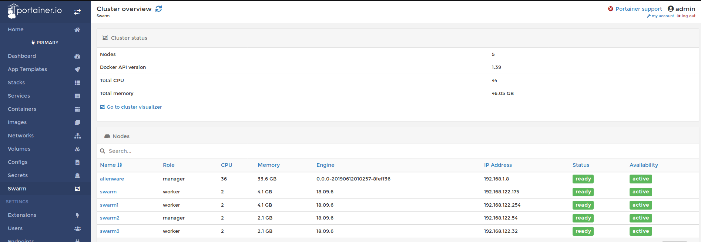

# Swarm-stack
docker swarm stack deploy demo

## Start the cluster by declairing the masters IP address
```
docker swarm init --advertise-addr <local ip>
```
## Use KVM or Hyper-v to create two virtual machines 
I use Ubuntu Server [Ubuntu Server 18.04.2 LTS](https://ubuntu.com/download/server). When you build your server keep to the naming convention like "swarm" and "swarm1".
Install docker on both of the virtual machines. I use the get-docker script for simplicity.

```
ssh <user>@<VM-Machine1>
sudo passwd <create a root password>
sudo apt update && sudo apt upgrade -y
curl -fsSL https://get.docker.com -o get-docker.sh
sudo sh get-docker.sh
su -
<root password>
usermod -aG docker <user>
systemctl restart docker
su - <user>
docker info  <you should get all the docker information back without a permission error>

##Issue the docker swarm join command with your generated token

docker swarm join --token XXXXXX-X-3XXXXXXXXXXXXXXXXXXXXXXXXXX-XXXXXXXXXXXXXXXXXXXXXXX 192.168.1.8:2377
```
## Repeat this process for another VM so you have 1 manager and 2 agents

```
docker node ls
ID                            HOSTNAME            STATUS              AVAILABILITY        MANAGER STATUS      ENGINE VERSION
23dfq1l3i3ku2vw3huu07y3u9 *   alienware           Ready               Active              Leader              0.0.0-20190612010257-8feff36
x4t00cdi7lbepnllvp88lplyj     swarm               Ready               Active                                  18.09.6
qgngrj1wdxru4xdlpj4zsvwmx     swarm1              Ready               Active                                  18.09.6
```
## Inspect your nodes
You can use the inspect command two different ways.  The most common method is to just add --pretty to get a human readable output.  
The other way is to --format the output and filter any field within the JSON output.
```
docker node inspect --format '{{.Status.Addr}}' swarm
192.168.122.175
```
## Portainer 
We are going install [Portainer](https://www.portainer.io/installation/) to get a visual representation with whats going on within the swarm.  
I linked the website because there is way more thing you can do with portainer but for this demo its just eye candy to see inside the cluster.
After deploying the agent stack check to make sure the services are being replicated across your swarm.

```
docker stack deploy --compose-file=portainer-agent-stack.yml portainer
docker service ls
ID                  NAME                  MODE                REPLICAS            IMAGE                        PORTS
r56tvhvahdqv        portainer_agent       global              3/3                 portainer/agent:latest       
nf0u42mf87sw        portainer_portainer   replicated          1/1                 portainer/portainer:latest   *:9000->9000/tcp

```
## Portainer UI
You should be able to access your portainer UI now on one of your agents IP:9000

```
docker service ps portainer_agent
ID                  NAME                                        IMAGE                    NODE                DESIRED STATE       CURRENT STATE         ERROR               PORTS
1cpxc6kqg956        portainer_agent.m7tm3y98ytoyt0llq67qtvwuo   portainer/agent:latest   swarm               Running             Running 2 hours ago                       
20qmlfbfzl33        portainer_agent.qgngrj1wdxru4xdlpj4zsvwmx   portainer/agent:latest   swarm1              Running             Running 2 hours ago                       
```
## Quorum
To make this cluster more fault [tolerant](https://docs.docker.com/engine/swarm/admin_guide/) lets add another manager and another agent to the cluster.
```
docker node ls
ID                            HOSTNAME            STATUS              AVAILABILITY        MANAGER STATUS      ENGINE VERSION
23dfq1l3i3ku2vw3huu07y3u9 *   alienware           Ready               Active              Leader              0.0.0-20190612010257-8feff36
x4t00cdi7lbepnllvp88lplyj     swarm               Ready               Active                                  18.09.6
qgngrj1wdxru4xdlpj4zsvwmx     swarm1              Ready               Active                                  18.09.6
m7tm3y98ytoyt0llq67qtvwuo     swarm2              Ready               Active              Reachable           18.09.6
if3cady0iv0mxdwk1b7vtqvxz     swarm3              Ready               Active                                  18.09.6
```


## Tick Stack
This next part I got the conf and compose files from [https://github.com/mlabouardy/swarm-tick](https://github.com/mlabouardy/swarm-tick)


